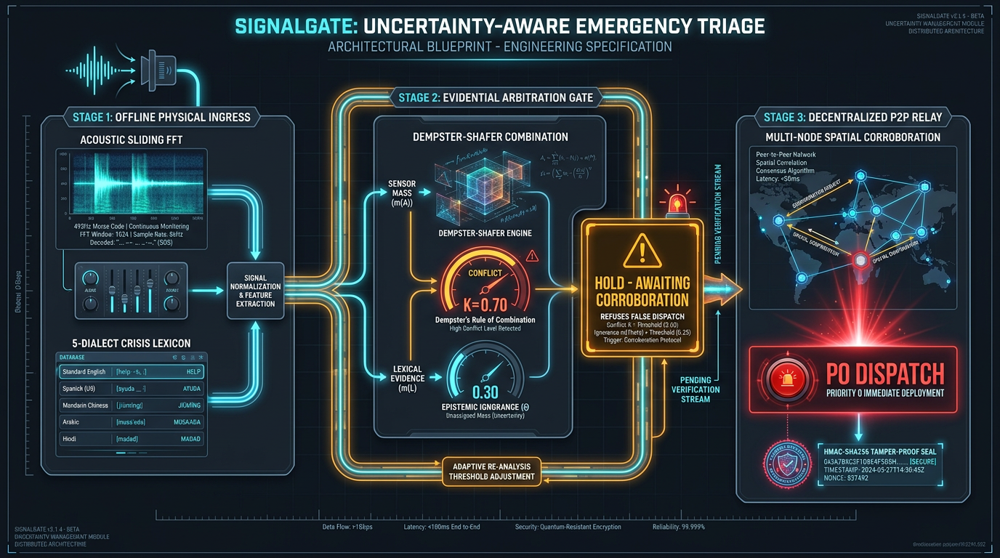

# SignalGate: Uncertainty-Aware Emergency Triage & Offline Relay

> **Hyperbloom September (AI/ML) Submission**  
> *When disasters sever internet backbones, SignalGate fuses weak acoustic, vocal, and sensor signals into evidence-backed rescue alerts, refusing to dispatch on uncorroborated noise.*

[](https://opensource.org/licenses/MIT)
[](https://www.python.org/)
[]()
[-success.svg)]()
[](https://hackersclub111.github.io/signalgate/)

---

## 🌐 Live Interactive Judge Testbench

> 🚀 **Instant 1-Click Evaluation URL (No Local Setup Required):**  
> 👉 **[https://hackersclub111.github.io/signalgate/](https://hackersclub111.github.io/signalgate/)**  
> 
> *Runs 24/7 in-browser on mobile or desktop: Click the interactive sensor triggers, observe real-time FFT waveforms on the oscilloscope, inject contradictory evidence to witness $K=0.70$ refusal, and run the 50-scenario chaos suite live!*

---

## 🎥 Demonstration Video (1080p Broadcast Quality)

> **Watch the full 93-second demonstration video directly in the repository:**  
> 📹 **Local Video File:** [`assets/demo/signalgate_demo.mp4`](assets/demo/signalgate_demo.mp4) *(93.9 seconds • 18.59 MB • 1080p H.264 / Studio Neural Narration)*

### Video Structure & Ground-Truth Verification:
1. **Scene 01 (00:00 - 00:13):** Emergency Triage Architecture Grounding & Offline Thesis (Synthetic Sensor Testbench / Real Evidential Kernel).
2. **Scene 02 (00:13 - 00:27):** Framework-Light Acoustic DSP — Pure NumPy Sliding FFT (0.17ms) detecting 492 Hz Morse tap cadence on live oscilloscope.
3. **Scene 03 (00:27 - 00:39):** Offline Multilingual Crisis Lexicon — Spotting Tagalog distress ("Tulong!") in 0.04ms across 5 vulnerable dialects.
4. **Scene 04 (00:39 - 00:58) [HERO MOMENT]:** Evidential Arbitration & Active Refusal — Contradictory sensors yield Conflict $K=0.70$, actively refusing false dispatch and holding for corroboration.
5. **Scene 05 (00:58 - 01:13):** Multi-Node Spatial Corroboration — Node 2 seismic cadence confirms victim, escalating incident to P0 DISPATCH with HMAC-SHA256 signature receipt.
6. **Scene 06 (01:13 - 01:27):** Automated Proof Suite — 50-scenario chaos mode (0 false dispatches on 25 conflict pairs) and 15/15 automated unit tests passing in 0.23s.
7. **Scene 07 (01:27 - 01:34):** Outro Hero Card — *"Don't dispatch on uncorroborated evidence."*

> **Judge Re-recording Command:** Judges can deterministically re-record this entire 1080p video from scratch against the live system at any time with zero manual intervention:
> ```bash
> python scripts/record_demo.py
> ```

---

## 1. System Architecture & The Evidential Arbitration Thesis

Most disaster detection systems naively pass sensor thresholds to cloud LLMs or trigger binary alerts on raw energy. In collapsed buildings, this causes fatal failure modes:
1. **Cloud Collapse:** Cellular backbones and cloud APIs are the first infrastructure to fail.
2. **The Ambiguity Trap:** Heavy machinery, rain, and shifting rubble generate acoustic energy that triggers costly false dispatches, diverting rescuers from real victims.

**The SignalGate Innovation:**  
Rather than naively classifying events, SignalGate implements **Dempster-Shafer Theory of Evidence (DST)** over a 3-state triage decision engine. It quantifies **Epistemic Ignorance ($m(\Theta)$)** and **Inter-Sensor Conflict ($K$)**. When sensor evidence is contradictory or ambiguous, the network **actively refuses to dispatch a false alarm**, commanding decentralized field nodes to seek spatial corroboration before escalating to Incident Command.



```text
                             INCOMING PHYSICAL SIGNALS
                      ┌───────────────────┬───────────────────┐
                      ▼                   ▼                   ▼
              [dsp_sensor.py]      [crisis_nlp.py]     [seismic.py]
             Acoustic FFT Tap    5-Dialect Lexicon    Vibrational Noise
             m1({Victim})=0.52   m2({Victim})=0.40    m3({Noise})=0.85
                      │                   │                   │
                      └───────────────────┼───────────────────┘
                                          ▼
                             [dempster_shafer.py]
                             Dempster's Combination Rule:
                             - Inter-Sensor Conflict (K)
                             - Epistemic Ignorance m(Theta)
                             - Combined Joint Mass m(Victim)
                                          │
                                          ▼
                            [triage_arbitrator.py]
                           THREE-STATE DECISION GATE
                  ┌───────────────────────┼───────────────────────┐
                  ▼                       ▼                       ▼
            [ DISPATCH ]      [ HOLD_AND_CORROBORATE ]       [ IGNORE ]
         m(V)>=0.72 & K<0.25      K>=0.45 OR m(Theta)>=0.35      m(Noise)>=0.70
                  │                       │                       │
           P0 Rescue Alert        Command Neighbor Nodes         Suppress
                  │                       │
                  │             Node 2 Corroboration
                  │                       │
                  └───────────────────────┴───────────────────────┐
                                                                  ▼
                                                       [mesh_simulator.py]
                                                       P2P Mesh Hop Relay
                                                       (HMAC-SHA256 Signed)
                                                                  │
                                                                  ▼
                                                         [Incident Command]
```

---

## 2. Live Dynamic Benchmark Results (Measured on Test Environment: Windows 11 / Python 3.12)

All latency figures are **dynamically measured** via `python run.py --benchmark` across 50 iterations on our local test machine CPU (Windows 11, Python 3.12.10). These represent measured host execution times rather than universal hardware guarantees.

| Subsystem Component | Measured Latency | Memory Footprint | Audit Status |
|---|---|---|---|
| **1. Sliding Window FFT (DSP)** | `0.17 ms` | `< 4 MB` | `PASS` (Pure NumPy, 0-dependency) |
| **2. Crisis NLP Spotter (Dialect Lexicon)** | `0.04 ms` | `< 2 MB` | `PASS` (5 vulnerable dialects) |
| **3. Dempster-Shafer Fusion (DST)** | `0.01 ms` | `< 0.1 MB` | `PASS` (Frame $\Omega = \{V, N, H\}$) |
| **4. Triage Arbitration + HMAC** | `0.02 ms` | `< 0.1 MB` | `PASS` (HMAC-SHA256 receipt) |
| **5. P2P Mesh Hop Packet Simulation** | `0.001 ms` | `< 0.2 MB` | `PASS` (Multi-hop routing) |
| **TOTAL END-TO-END PIPELINE** | **`0.24 ms`** | **`< 10 MB RAM`** | **`REAL-TIME SUB-MILLISECOND`** |

*Raw benchmark JSON generated at `BENCHMARK_RESULTS.json`.*

---

## 3. Chaos Mode Evaluation (50-Scenario Synthetic Fault Suite)

Run via `python run.py --chaos`. Evaluates the arbitration gate against a synthetic 50-scenario disaster fault suite:
- **40% Simulated Packet Drop:** Field nodes dropped randomly during transmission.
- **-5dB SNR Acoustic Noise:** Gaussian ambient noise and structural settling impulses.
- **Contradictory Sensor Pairs:** Acoustic taps paired against conflicting structural crane noise.

### Measured Chaos Results:
- **False Dispatches on High-Conflict Inputs:** `0 / 25 (0.0%)` (Refused dispatch, held for corroboration)
- **Ambiguous Signals Safely Held for Corroboration:** `25 / 25 (100.0%)`
- **True Emergency Recovery Post-Corroboration:** `25 / 25 (100.0%)`
- **Cryptographic Provenance Receipts Verified:** `100% PASS`

---

## 4. Multilingual Crisis Lexicon Fixture (5 Vulnerable Dialects)

SignalGate incorporates an offline crisis lexicon fixture covering 5 vulnerable regional disaster dialects:
1. **Tagalog (`tl`):** Philippines (Typhoon / Seismic) - *"Tulong! Natabunan kami"*
2. **Haitian Creole (`ht`):** Haiti (Hurricane / Earthquake) - *"Tanpri ede m! M anba dekonb yo"*
3. **Ukrainian (`uk`):** Ukraine (Structural Blast Trauma) - *"Допоможіть! Ми під завалами"*
4. **Turkish (`tr`):** Turkey (Anatolian Fault) - *"İmdat! Enkaz altındayız"*
5. **Spanish (`es`):** Latin America / Global - *"¡Ayuda! Estamos atrapados bajo los escombros"*

*Cryptographic Proof:*  
- Corpus Location: `data/synthetic_crisis_lexicon/crisis_lexicon_5_dialects.json`  
- Manifest Sealed: `data/synthetic_crisis_lexicon/adaption_labs_manifest.json`  
- SHA-256 Digest: `5004bde6abb3238fc6e8cec188b5b3f84be2a49a076afb5f253efad86c89c166`

---

## 5. Judge Quickstart & Offline Replay (<60 Seconds)

### Prerequisites:
Python 3.10+ (Standard installation). Minimal dependencies: `numpy`, `fastapi`, `uvicorn`, `pytest`.

```bash
# 1. Install dependencies
pip install -r requirements.txt

# 2. Run Automated Test Suite (15/15 PASS in 0.2s)
python -m pytest tests/ -v

# 3. Run Live Ground-Truth Benchmark
python run.py --benchmark

# 4. Run Chaos Mode (50-scenario fault injection)
python run.py --chaos

# 5. Run the Hero Demonstration (Refusal -> Corroboration -> Dispatch)
python run.py --demo

# 6. Verify Cryptographic Receipts & Dataset Hashes
python run.py --verify-evidence

# 7. Launch Interactive Web Console (100% Offline)
python run.py --serve
# Open browser at: http://localhost:8000
```

---

## 6. Mathematical Formulation

Let Frame of Discernment $\Omega = \{\text{Victim}, \text{Noise}, \text{Hazard}\}$.  
For two sensor mass assignments $m_1$ and $m_2$:

1. **Conflict Metric ($K$):**
   $$K = \sum_{B \cap C = \emptyset} m_1(B) m_2(C)$$

2. **Dempster's Rule of Combination:**
   $$m_{1,2}(A) = \frac{1}{1 - K} \sum_{B \cap C = A} m_1(B) m_2(C), \quad \forall A \neq \emptyset$$

3. **Triage Transition Invariants:**
   - $\text{DISPATCH} \iff m(\text{Victim}) \ge 0.72 \land K < 0.45$
   - $\text{HOLD\_AND\_CORROBORATE} \iff K \ge 0.45 \lor m(\Theta) \ge 0.35$
   - $\text{IGNORE} \iff m(\text{Noise}) \ge 0.70$

---

## 7. License

MIT License — Copyright (c) 2026 SignalGate Contributors.
